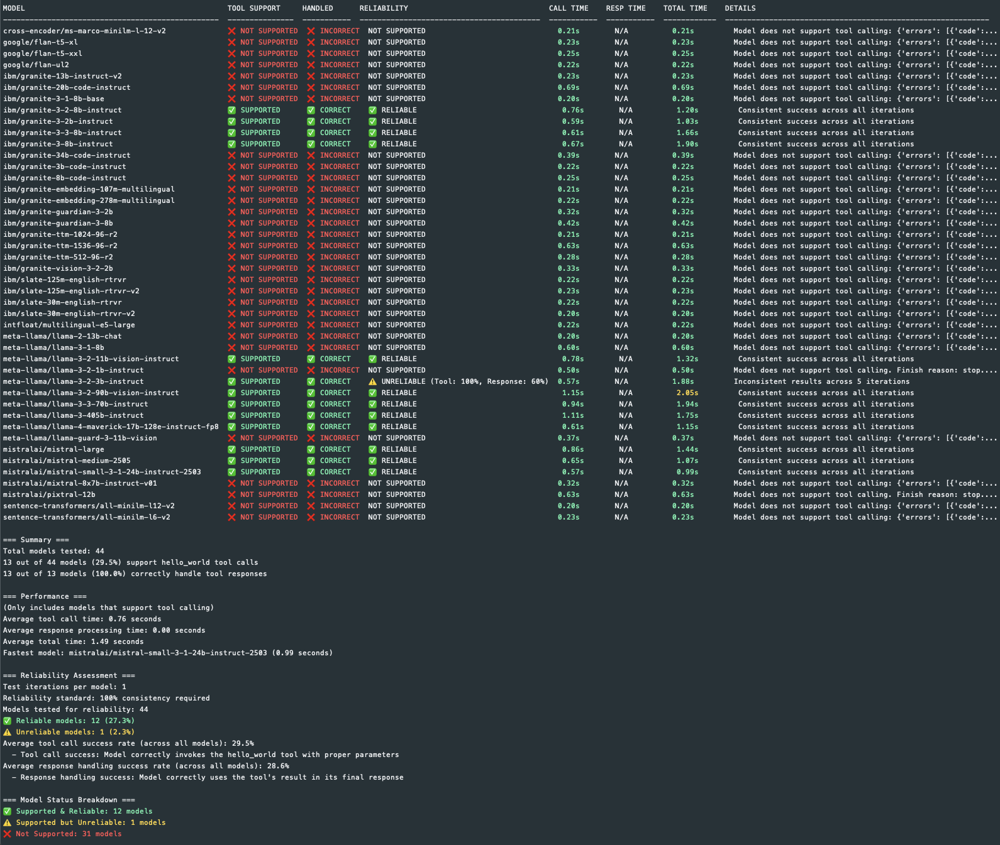

# WatsonX Tool Tester

A Python tool for testing call capabilities of AI models in IBM WatsonX and via LiteLLM proxies.
This is a simple tool to test whether AI models can properly invoke a simple tool when prompted and process the tool response and use the results correctly. It is a brute-force test that tries to call the tool in multiple ways and checks if the model can handle the result. By default it runs against all available models and does not attempt to determine if the model should support the tool or not.

## Overview

WatsonX Tool Tester provides a standardized way to test whether AI models can properly:
1. Invoke a simple tool when prompted
2. Process the tool response and use the results correctly

The package supports direct testing against WatsonX.ai API or through a LiteLLM proxy server.



<!-- TOOL_TEST_REPORT_START -->
## 🔧 Tool Test Status

📊 **[Latest Tool Test Report](https://daniel-butler-irl.github.io/watsonx_model_tool_test/reports/latest_report.html)**

- **Last Updated:** 2025-08-08 06:49:37 UTC
- **Test Iterations:** 50 per model
- **All Reports:** [Browse Reports Directory](https://daniel-butler-irl.github.io/watsonx_model_tool_test/reports/)

*Reports generated daily at 06:00 UTC and on push to main branch. Include 90-day trend analysis and reliability assessment.*
<!-- TOOL_TEST_REPORT_END -->

## How Tests Work

The tool testing process evaluates two key capabilities:

1. **Tool Call Support**: Tests if a model correctly identifies when to use a tool and properly invokes it with the right parameters.
2. **Result Handling**: Tests if a model can correctly process and utilize the results returned by the tool.

### The Hello World Tool Test

Models are tested using a simple `hello_world` tool that:
- Takes a "name" parameter (required) and a "language" parameter (optional)
- Returns a greeting in the specified language

The test works as follows:
1. The model is asked to greet someone in a specific language using the tool
2. **ONLY** if the model correctly invokes the tool using proper structured tool calling (with `finish_reason: "tool_calls"`), that counts as "TOOL SUPPORT"
3. The test then feeds the tool's response back to the model
4. If the model correctly incorporates the exact greeting from the tool in its response, that counts as "TOOL RESULT HANDLED"

### Supported Tool Call Format

The tool tester **ONLY** accepts the OpenAI-standard structured tool calling format:

```json
{
  "choices": [{
    "message": {
      "role": "assistant",
      "tool_calls": [{
        "function": {
          "name": "hello_world",
          "arguments": "{\"name\":\"Daniel\",\"language\":\"spanish\"}"
        }
      }]
    },
    "finish_reason": "tool_calls"
  }]
}
```

**No other formats are supported.** Models must use the server-side tool calling API to pass the test.

### Success Criteria

Success in these tests is measured at two levels:

- **Partial Success**: The model correctly identifies when to use the tool and invokes it with valid parameters.
- **Full Success**: The model not only invokes the tool correctly but also properly uses the results returned by the tool.

Only models that achieve full success are considered in the performance metrics (average times and fastest model determination).

### Reliability Testing

By default, each model is tested once. However, you can enable reliability testing to run multiple iterations per model:

```bash
# Test each model 3 times
watsonx-tool-tester test --iterations 3

# Test specific model multiple times
watsonx-tool-tester test --model "ibm/granite-3-2b-instruct" --iterations 5
```

**Reliability Assessment:**
- Models are tested multiple times to identify inconsistent behavior
- A model is marked as **RELIABLE** (✅) if it achieves ≥90% success rate for both tool calling and response handling
- A model is marked as **UNRELIABLE** (⚠️ with success rates) if it falls below the 90% threshold
- The 90% threshold (defined in `RELIABILITY_THRESHOLD`) allows for occasional network issues or API timeouts while maintaining high quality standards
- Models that don't support tool calling are marked as **NOT SUPPORTED** rather than unreliable
- The tool reports individual success rates for tool calling and response handling

**Use Cases for Reliability Testing:**
- Identifying models that are inconsistent in their tool calling behavior
- Measuring the stability of tool calling implementations
- Detecting models that may work sometimes but fail intermittently
- Validating model performance before production deployment

**Environment Variables:**
```bash
export WATSONX_TOOL_ITERATIONS=3
```

## Installation

```bash
# Clone the repository
git clone https://github.com/daniel-butler-irl/watsonx_model_tool_test.git
cd watsonx_model_tool_test

# Install the package
pip install .

# Or install in development mode
pip install -e .

# Install with development dependencies
pip install -e ".[dev]"
```

## Usage

### Command Line Interface

The package provides a command-line interface for running tests:

```bash
# Test all models in WatsonX
watsonx-tool-tester test --client watsonx \
    --watsonx-apikey YOUR_API_KEY \
    --watsonx-project-id YOUR_PROJECT_ID

# Test a specific model
watsonx-tool-tester test --client watsonx \
    --watsonx-apikey YOUR_API_KEY \
    --watsonx-project-id YOUR_PROJECT_ID \
    --model ibm/granite-20b-instruct

# Exclude specific models from testing
watsonx-tool-tester test --client watsonx \
    --watsonx-apikey YOUR_API_KEY \
    --watsonx-project-id YOUR_PROJECT_ID \
    --exclude "ibm/granite-20b-instruct" --exclude "meta-llama/llama-2-70b-chat"

# Exclude models using a file with model names/patterns
watsonx-tool-tester test --client watsonx \
    --watsonx-apikey YOUR_API_KEY \
    --watsonx-project-id YOUR_PROJECT_ID \
    --exclude-file excludes.txt

# List available models
watsonx-tool-tester list-models --client watsonx \
    --watsonx-apikey YOUR_API_KEY \
    --watsonx-project-id YOUR_PROJECT_ID

# Test models via LiteLLM proxy
watsonx-tool-tester test --client litellm \
    --litellm-url http://localhost:8000 \
    --litellm-token YOUR_TOKEN

# Test models multiple times for reliability assessment
watsonx-tool-tester test --client watsonx \
    --watsonx-apikey YOUR_API_KEY \
    --watsonx-project-id YOUR_PROJECT_ID \
    --iterations 3

# Generate HTML report instead of JSON
watsonx-tool-tester test --client watsonx \
    --watsonx-apikey YOUR_API_KEY \
    --watsonx-project-id YOUR_PROJECT_ID \
    --output report.html --html-output
```

### HTML Report Generation

The tool can generate beautiful, interactive HTML reports instead of JSON output:

```bash
# Generate HTML report
watsonx-tool-tester test --output report.html --html-output

# Or combine with reliability testing
watsonx-tool-tester test --iterations 5 --output detailed_report.html --html-output
```

**HTML Report Features:**
- **Interactive Interface**: Filter and sort results by model, support status, and performance
- **Visual Analytics**: Charts showing model support categories and performance metrics
- **Responsive Design**: Works on desktop and mobile devices
- **Modern Styling**: Clean, professional appearance with IBM design system colors
- **Detailed Metrics**: Comprehensive reliability assessment and timing analysis
- **Historical Data**: Performance timelines (when run as part of CI pipeline)
- **Export Ready**: Self-contained HTML file that can be shared or hosted

The HTML report includes:
- Summary statistics with visual indicators
- Interactive results table with filtering and sorting
- Performance charts and reliability metrics
- Responsive design for all screen sizes
- Professional styling with hover effects and animations

**Generate HTML reports**: Use `watsonx-tool-tester test --html-output report.html` to generate HTML reports locally.

### Using environment variables

You can also use environment variables to configure the tool:

```bash
export WATSONX_APIKEY=YOUR_API_KEY
export WATSONX_PROJECT_ID=YOUR_PROJECT_ID
export WATSONX_TOOL_CLIENT=watsonx  # or litellm
export WATSONX_TOOL_EXCLUDE="ibm/granite-20b-instruct,meta-llama/llama-2-70b-chat"  # Comma-separated list of models to exclude
export WATSONX_TOOL_EXCLUDE_FILE="./excludes.txt"   # File with models to exclude

watsonx-tool-tester test
```

For LiteLLM:

```bash
export LITELLM_URL=http://localhost:8000
export LITELLM_TOKEN=YOUR_TOKEN
export WATSONX_TOOL_CLIENT=litellm

watsonx-tool-tester test
```

### Python API

You can also use the package programmatically in your Python code:

```python
from watsonx_tool_tester import Config, ClientType, ModelTester

# Configure the tester
config = Config(
    client_type=ClientType.WATSONX,
    watsonx_apikey="YOUR_API_KEY",
    watsonx_project_id="YOUR_PROJECT_ID",
    debug=True,  # Enable verbose logging
)

# Create the tester
tester = ModelTester(config)

# Test all models
results = tester.test_all_models()

# Test a specific model
results = tester.test_all_models(filter_model="ibm/granite-20b-instruct")

# Exclude specific models
config.exclude_models = ["model1", "model2"]
results = tester.test_all_models()
```

## Test Results Explained

The test results are presented in a table format with the following columns:

| Column | Description |
|--------|-------------|
| MODEL | The model ID being tested |
| TOOL SUPPORT | Whether the model correctly invokes the tool (✅ or ❌) |
| HANDLED | Whether the model correctly uses the results returned by the tool (✅ or ❌) |
| RELIABILITY | Reliability assessment when testing multiple iterations (✅ for models with ≥90% success rate on both tool calls and response handling, ⚠️ for models with <90% success rates, or "NOT SUPPORTED" for models without tool calling capability). Shows iteration count in header (e.g., "RELIABILITY (5x)"). The 90% threshold allows for occasional network issues while maintaining high quality standards. |
| CALL TIME | Time taken for the model to generate the initial tool call |
| RESP TIME | Time taken for the model to process the tool response |
| TOTAL TIME | Sum of tool call time and response time |
| DETAILS | Additional information about test results, errors, or reliability metrics |

### Results Summary

After the table, a summary section provides:

1. **Basic Statistics**:
   - Total models tested
   - Number of models that support tool calls
   - Number of models that correctly handle tool responses

2. **Performance Metrics** (only for fully successful models):
   - Average tool call time
   - Average response processing time
   - Average total time
   - Fastest model (based on total time)

3. **Reliability Assessment** (when using `--iterations > 1`):
   - Test iterations per model
   - ≥90% success rate required for reliability
   - Number of reliable vs unreliable models
   - Average success rates across all models

4. **Support Categories**:
   - Full support: Models that can call the tool and use its result
   - Partial support: Models that can call the tool but ignore its result
   - No support: Models that cannot call the tool at all


## Available Configuration Options

| CLI Option               | Environment Variable      | Description                            |
|--------------------------|---------------------------|----------------------------------------|
| `--client`               | `WATSONX_TOOL_CLIENT`     | Client type (`watsonx` or `litellm`)   |
| `--watsonx-url`          | `WATSONX_URL`             | URL for WatsonX API                    |
| `--watsonx-apikey`       | `WATSONX_APIKEY`          | API key for WatsonX API                |
| `--watsonx-project-id`   | `WATSONX_PROJECT_ID`      | Project ID for WatsonX API             |
| `--watsonx-region`       | `WATSONX_REGION`          | Region for WatsonX API                 |
| `--watsonx-api-version`  | `WATSONX_API_VERSION`     | API version for WatsonX API            |
| `--litellm-url`          | `LITELLM_URL`             | URL for LiteLLM proxy API              |
| `--litellm-token`        | `LITELLM_TOKEN`           | Authentication token for LiteLLM proxy  |
| `--model`, `-m`          | `WATSONX_TOOL_MODEL`      | Specific model to test                 |
| `--exclude`              | `WATSONX_TOOL_EXCLUDE`    | Models to exclude from testing         |
| `--exclude-file`         | `WATSONX_TOOL_EXCLUDE_FILE` | File with models to exclude            |
| `--sort`                 | `WATSONX_TOOL_SORT`       | How to sort results                    |
| `--iterations`           | `WATSONX_TOOL_ITERATIONS` | Number of test iterations per model (default: 5) |
| `--debug`, `-d`          | `WATSONX_TOOL_DEBUG`      | Enable debug logging                   |
| `--log-dir`              | `WATSONX_TOOL_LOG_DIR`    | Directory for log files                |
| `--output`, `-o`         | `WATSONX_TOOL_OUTPUT`     | File to save results                   |
| `--html-output`          | `WATSONX_TOOL_HTML_OUTPUT` | Generate HTML report instead of JSON   |

## Development

### Setup Development Environment

```bash
# Clone the repository
git clone https://github.com/daniel-butler-irl/watsonx_model_tool_test.git
cd watsonx_model_tool_test

# Install development dependencies
pip install -e ".[dev]"
```

### Running Tests

```bash
# Use make targets for common tasks
make test           # Run all tests
make lint           # Run linter checks
make format         # Format code
make check          # Run all checks

# Or run pytest directly
pytest
pytest --cov=watsonx_tool_tester
pytest tests/tools/test_hello_world.py
```

## License

This project is licensed under the [Apache License 2.0](LICENSE).


### Automated Testing Setup

This repository includes automated daily testing via GitHub Actions. To set up automated testing in your fork:

1. **Configure Repository Secrets**: Add your WatsonX API credentials as repository secrets
2. **Enable Actions**: Ensure GitHub Actions are enabled in your repository
3. **Review Configuration**: Check the workflow settings in `.github/workflows/daily-tool-test.yml`

📖 **[Complete Setup Guide](.github/ACTIONS_SETUP.md)** - Detailed instructions for configuring automated testing

### Automated Performance Tracking

The GitHub Actions workflow includes automated performance tracking that stores detailed test results over time for trend analysis:

**CI Pipeline Features:**
- **Historical Data Storage**: Complete test details stored in CSV files within `reports/history/`
- **Performance Trends**: Automatic analysis of model performance over time
- **Error Pattern Detection**: Tracking of failure patterns and common issues
- **Service-Outage Style Views**: Visual timeline showing model reliability in HTML reports
- **Data Retention**: Configurable cleanup of old data (90 days by default)

**Data Structure (for CI pipeline):**
- `reports/history/test_results.csv` - Complete test details for each run
- `reports/history/models_registry.csv` - Model performance summary and metrics  
- `reports/history/daily_summary.csv` - Daily aggregated statistics

**Note**: Historical tracking is primarily designed for the automated CI pipeline. Manual testing will contribute to the history but the main benefit is seen in the daily automated reports that show trends over time.

